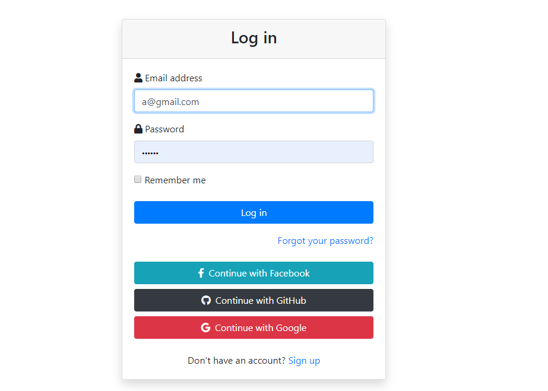

# Beautiful OAuth Login template with Rails

## Link
### Github link : https://github.com/jasonkim7288/rails_omniauth
### Deploy link : https://oauthjason.herokuapp.com/

## Description
Whenever making a Rails app, log in functions are needed, so here is a template for log in functions with OAuth in it.

## Tech stack
- Rails : Front end and back end source code
- Heroku : deploy the code
- OmniAuth : OAuth2 implementation gem
- devise : login gem
- bootstrap : make pages look pretty using gem
